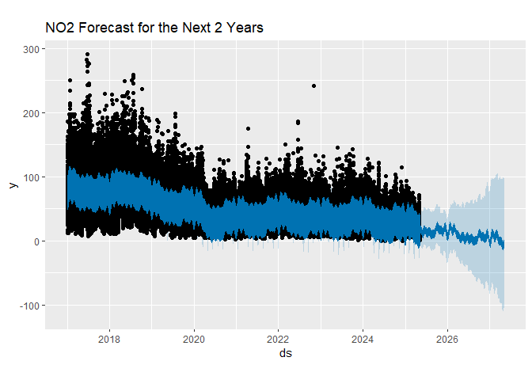
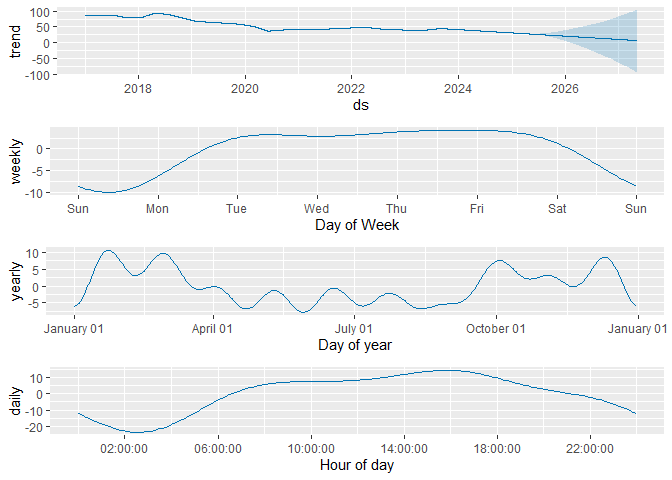
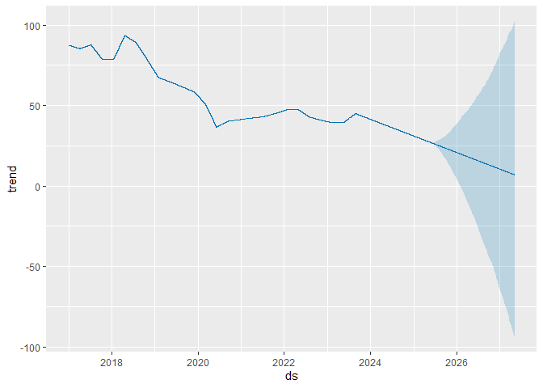
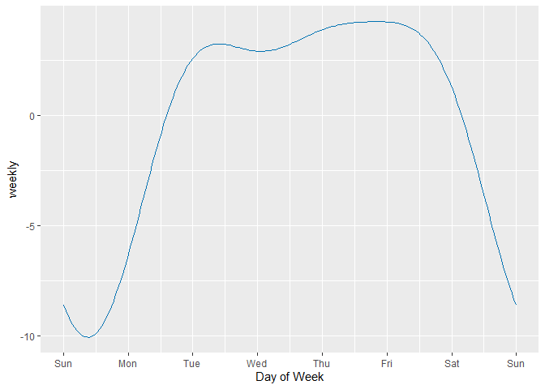
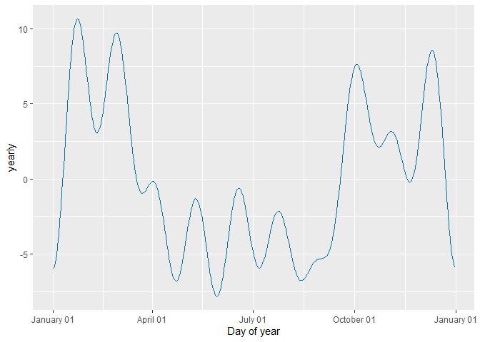
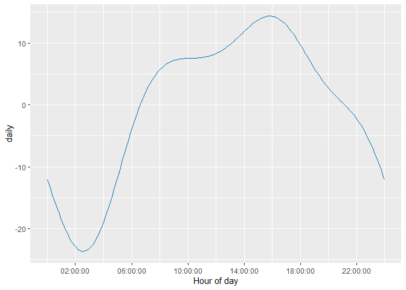
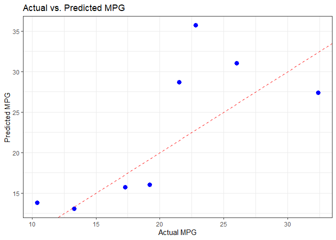
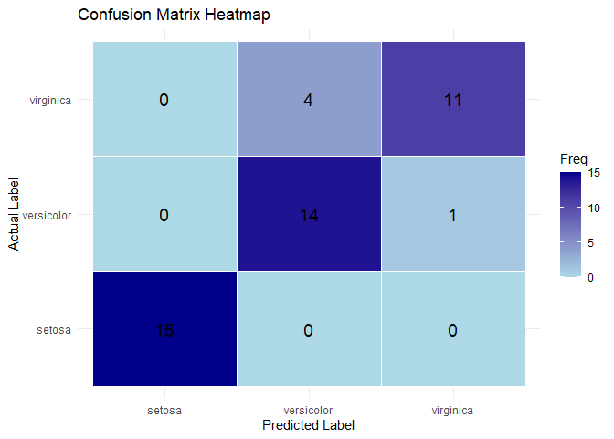
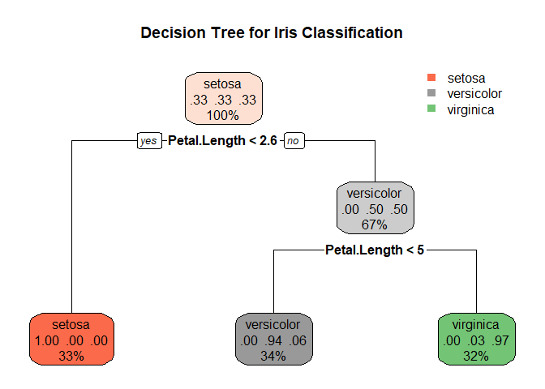
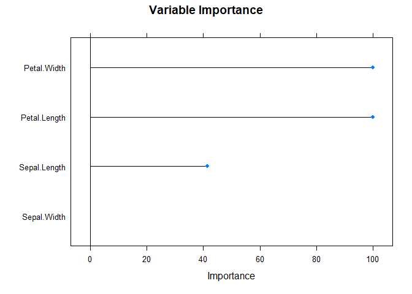

# Advanced Data Science Methods in R

2025-05-06

# Introduction

This document guides the user through the material presented in the
Advanced Data Science Methods lecture.

# Prophet

This section demonstrates the usage of Prophet as a tool for analysing
air pollution data

## Package Loading

We begin by loading the packages for Prophet.

``` r
library(openair)
library(ggplot2)
library(prophet)
library(dplyr)
```

## Load the Data

We start by loading the data. We will use the `openair` package to
import the AURN data for the site MY1.

The data set used is from from 2017 to 2025 which gives a stable
baseline as well as showing the impact of COVID 19 lock-downs.

We also need to rename the columns because Prophet expects the date
column to be ds and the measurement column to be y. This is not
optional.

``` r
my1 = openair::importAURN(site = "MY1", year = 2017:2025)

df <- my1 %>% 
  rename(ds = date, y = no2)
```

## Make a Model

We now need to make a model that we will call `m`. We also make a future
dataframe `future` that will contain the data for our predictions. We
specify the length of the data frame in this case ~2 years or 730 days.

``` r
m <- prophet(df)

future <- make_future_dataframe(m, periods = (730))
```

## Make a Forecast

We can now use the `predict` function to make a forecast. The `predict`
function takes the model and the future data frame as arguments. The
result is a data frame with the forecasted values.

``` r
forecast <- predict(m, future)
```

## Plot the Results

We can now create a visualisation of our predictions.

``` r
p = plot(m, forecast) + ggtitle("NO2 Forecast for the Next 2 Years")
print(p)
```



We can also look at the decomposition of the time series in various time
periods.

``` r
components = prophet_plot_components(m, forecast)
```



``` r
print(components)
```

    [[1]]




    [[2]]




    [[3]]




    [[4]]



# Big Data Concepts

## Regression

We will now go through regression using the `caret` package.

``` r
library(caret)
```

    Loading required package: lattice

We will use the `cars` data set which is built into R. This is a test
data set used for demonstrating processes like this. We will also
`set.seed` to ensure that the results are repeatable.

``` r
data(mtcars)
set.seed(42)
```

We will now set up our training data set of 70% of the data and our test
data with the other 30%.

``` r
train_index <- createDataPartition(mtcars$mpg, p = 0.7, list = FALSE)
train_data <- mtcars[train_index, ]
test_data  <- mtcars[-train_index, ]
```

We can now train a model using our training data set

``` r
model_reg <- train(mpg ~ ., data = train_data, method = "lm")
```

    Warning in predict.lm(modelFit, newdata): prediction from a rank-deficient fit
    may be misleading

We can now test our model using the `test_data` dataset that we kept
from the analysis.

We can make some assessment of the quality of the model using the root
mean squared error `rmse` of our data

``` r
pred_reg <- predict(model_reg, test_data)
rmse <- sqrt(mean((pred_reg - test_data$mpg)^2))
cat("Test RMSE:", round(rmse, 2), "\n")
```

    Test RMSE: 6.06 

We can visualise the results to get a better understanding of what’s
going on.

``` r
r = results <- data.frame(
  actual = test_data$mpg,
  predicted = pred_reg,
  residuals = test_data$mpg - pred_reg
)

p = ggplot(results, aes(x = actual, y = predicted)) +
     geom_point(color = "blue", size = 3) +
     geom_abline(intercept = 0, slope = 1, color = "red", linetype = "dashed") +
     labs(title = "Actual vs. Predicted MPG",
       x = "Actual MPG",
       y = "Predicted MPG") +
     theme_bw()

print(p)
```



## Classification

We can use the `iris` data set to demonstrate classification. The `iris`
data set is a built-in data set in R that contains measurements of
different species of iris flowers.

This data set is categorical so using regression is not appropriate.

We will add the `rpart.plot` package for plotting later.

``` r
library(rpart.plot)
```

    Loading required package: rpart

We start by loading the data as before. Again we set the seed for
consistency.

``` r
data(iris)
set.seed(42)
```

We will create a training and test data set as before.

``` r
train_index <- createDataPartition(iris$Species, p = 0.7, list = FALSE)
train_data <- iris[train_index, ]
test_data  <- iris[-train_index, ]
```

We can now train the data.

``` r
model_class <- train(Species ~ ., data = train_data, method = "rpart")
```

We can make our predictions using the `test_data` set as before but we
will now create a confusion matrix to visualise our results rather than
use a linear regression plot.

``` r
pred_class <- predict(model_class, test_data)
conf_matrix <- confusionMatrix(pred_class, test_data$Species)
print(conf_matrix)
```

    Confusion Matrix and Statistics

                Reference
    Prediction   setosa versicolor virginica
      setosa         15          0         0
      versicolor      0         14         4
      virginica       0          1        11

    Overall Statistics
                                              
                   Accuracy : 0.8889          
                     95% CI : (0.7595, 0.9629)
        No Information Rate : 0.3333          
        P-Value [Acc > NIR] : 1.408e-14       
                                              
                      Kappa : 0.8333          
                                              
     Mcnemar's Test P-Value : NA              

    Statistics by Class:

                         Class: setosa Class: versicolor Class: virginica
    Sensitivity                 1.0000            0.9333           0.7333
    Specificity                 1.0000            0.8667           0.9667
    Pos Pred Value              1.0000            0.7778           0.9167
    Neg Pred Value              1.0000            0.9630           0.8788
    Prevalence                  0.3333            0.3333           0.3333
    Detection Rate              0.3333            0.3111           0.2444
    Detection Prevalence        0.3333            0.4000           0.2667
    Balanced Accuracy           1.0000            0.9000           0.8500

``` r
conf_df <- as.data.frame(conf_matrix$table)
```

We may want to make this output a bit nicer so we can use the `heatmap`
option in `ggplot2` to do this.

``` r
ggplot(conf_df, aes(x = Prediction, y = Reference, fill = Freq)) +
  geom_tile(color = "white") +
  geom_text(aes(label = Freq), color = "black", size = 5) +
  scale_fill_gradient(low = "lightblue", high = "darkblue") +
  labs(title = "Confusion Matrix Heatmap", x = "Predicted Label", y = "Actual Label") +
  theme_minimal()
```



We can also visualise the decision tree.

``` r
rpart.plot(model_class$finalModel, 
           main = "Decision Tree for Iris Classification",
           extra = 104)
```



``` r
importance <- varImp(model_class)
print(importance)
```

    rpart variable importance

                 Overall
    Petal.Length  100.00
    Petal.Width   100.00
    Sepal.Length   41.54
    Sepal.Width     0.00

``` r
# Plot variable importance
plot(importance, main = "Variable Importance")
```



## Zero Shot Classification

Achieving Zero-Shot classification in R is a bit more complicated and we
will need to link R to python to do this. We can do this using the
`reticulate` package.

``` r
library(reticulate)
```

We are now going to try and load some python packages, `transformers`
and `torch`. These are the building blocks of LLMs in Python and don’t
have readily accessible R alternatives.

We won’t let that stop us though!

``` r
py_install("transformers", pip=TRUE)
```

    Using virtual environment "C:/Users/tracru/AppData/Local/R/cache/R/reticulate/uv/cache/archive-v0/eQQqtACVe6DwfybPi3fUj" ...

    + "C:/Users/tracru/AppData/Local/R/cache/R/reticulate/uv/cache/archive-v0/eQQqtACVe6DwfybPi3fUj/Scripts/python.exe" -m pip install --upgrade --no-user transformers

``` r
py_install("torch", pip=TRUE)
```

    Using virtual environment "C:/Users/tracru/AppData/Local/R/cache/R/reticulate/uv/cache/archive-v0/eQQqtACVe6DwfybPi3fUj" ...

    + "C:/Users/tracru/AppData/Local/R/cache/R/reticulate/uv/cache/archive-v0/eQQqtACVe6DwfybPi3fUj/Scripts/python.exe" -m pip install --upgrade --no-user torch

``` r
py_require("transformers")
py_require("torch")

transformers <- import("transformers")
torch <- import("torch")

py_config()
```

    python:         C:/Users/tracru/AppData/Local/R/cache/R/reticulate/uv/cache/archive-v0/eQQqtACVe6DwfybPi3fUj/Scripts/python.exe
    libpython:      C:/Users/tracru/AppData/Roaming/uv/python/cpython-3.11.11-windows-x86_64-none/python311.dll
    pythonhome:     C:/Users/tracru/AppData/Local/R/cache/R/reticulate/uv/cache/archive-v0/eQQqtACVe6DwfybPi3fUj
    virtualenv:     C:/Users/tracru/AppData/Local/R/cache/R/reticulate/uv/cache/archive-v0/eQQqtACVe6DwfybPi3fUj/Scripts/activate_this.py
    version:        3.11.11 (main, Feb 12 2025, 14:49:02) [MSC v.1942 64 bit (AMD64)]
    Architecture:   64bit
    numpy:          C:/Users/tracru/AppData/Local/R/cache/R/reticulate/uv/cache/archive-v0/eQQqtACVe6DwfybPi3fUj/Lib/site-packages/numpy
    numpy_version:  2.2.5
    transformers:   C:\Users\tracru\AppData\Local\R\cache\R\RETICU~1\uv\cache\ARCHIV~1\EQQQTA~1\Lib\site-packages\transformers

    NOTE: Python version was forced by VIRTUAL_ENV

We can now create a pipeline for performing the zero-shot analysis.

A pipeline is a previously constructed method for solving a specific
problem. If you want to go into more depth on this topic you may want to
look at <https://huggingface.co>. You will probably also need to get
familiar with Python. More details are beyond the scope of this lecture.

``` r
classifier <- transformers$pipeline(
  "zero-shot-classification",
  model = "facebook/bart-large-mnli",
  framework='pt'
)
```

We can now classify a `sequence` of words based on our
`candidate_labels`.

Note that we don’t need to rely on anything other than our chosen
candidate labels.

``` r
sequence <- "The economy is experiencing rapid growth and innovation."
candidate_labels <- c("economics", "politics", "technology", "sports")

# Perform zero-shot classification
result <- classifier(sequence, candidate_labels)

# Print the result
print(result)
```

    $sequence
    [1] "The economy is experiencing rapid growth and innovation."

    $labels
    [1] "economics"  "technology" "sports"     "politics"  

    $scores
    [1] 0.950342476 0.034926664 0.008186772 0.006544026
